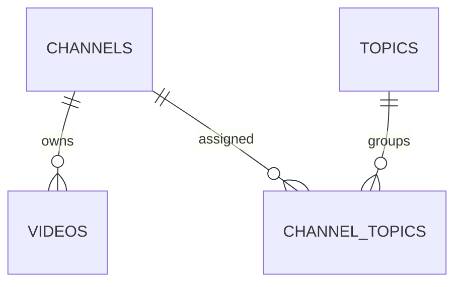

# Database guide

## Source of truth

The database is SQLite at `youfind.db`, opened by `src/db.js` with WAL mode and foreign keys enabled.

The schema is currently hybrid:

- legacy tables/columns are bootstrapped and extended in `src/db.js`;
- `jobs`, `jobs.results`, and `schema_migrations` are managed by `src/migrations.js`.

Do not add a durable column with an untracked `ALTER TABLE`. Add a migration and a test.

## Entity model



Only the three relations above are enforced by SQLite foreign keys. `feedback_log` is an append-only history without a foreign key, `watched_videos` stores video URLs without a foreign key, and `jobs.results` is a bounded JSON column rather than a normalized `job_results` table.

## Tables

### `channels`

- `id INTEGER PRIMARY KEY`: internal SQLite ID used by most `/channels/:id` routes;
- `channel_id TEXT UNIQUE NOT NULL`: public YouTube ID (`UC` + 22 characters);
- `nom TEXT NOT NULL`;
- `status`: `pending`, `validated`, or `rejected`;
- `date_ajout`, `last_refresh`, `last_video_date`: timestamps stored as text;
- `raison_rejet`: rejection reason;
- `subscriber_count`: integer, default `0`;
- `llm_summary`: model summary;
- `llm_score`: nullable numeric score, expected range `0..100`;
- `thumbnail`, `description`: external metadata.

### `videos`

- `id INTEGER PRIMARY KEY`;
- `channel_id`: YouTube channel ID, foreign key to `channels(channel_id)`;
- `titre`, `description`, `url`, `thumbnail`, `date_pub`;
- `url TEXT UNIQUE NOT NULL`: upsert key;
- `vues INTEGER DEFAULT 0`;
- `duration INTEGER DEFAULT 0`: seconds, `0` means unknown.

### `topics`

- `id INTEGER PRIMARY KEY`;
- `nom TEXT NOT NULL`;
- `description`;
- `date_ajout`;
- `display_order`: UI ordering.

### `channel_topics`

Many-to-many join table:

- `channel_id` references `channels(channel_id)` with cascade delete;
- `topic_id` references `topics(id)` with cascade delete;
- composite primary key prevents duplicates.

### `feedback_log`

Append-only validation/rejection history:

- `channel_id`, `channel_nom`;
- `decision`: `validated` or `rejected`;
- `raison`, `date_decision`.

Rejected feedback contributes to the LLM prompt and discovery blacklist.

### `settings`

Key/value configuration table. `openrouter_key` is stored here but must be redacted from public settings and exports.

### `watched_videos`

- `url TEXT PRIMARY KEY`;
- `watched_at` timestamp.

### `jobs`

Managed by migrations:

- `id`, `type`, `mode`, `status`;
- `total`, `completed`, `succeeded`, `failed`;
- `current`, `failures`, `payload`, `results`, `error`;
- `created_at`, `started_at`, `finished_at`.

Allowed statuses:

```text
queued | running | paused | done | error | cancelled | interrupted
```

Current job types are `scoring` and `related-discovery`. There is no lease, worker identity, persistent cancellation flag, or `job_items` table yet.

### `schema_migrations`

Stores `version`, `name`, and `applied_at`. Unknown future versions and name mismatches must fail loudly.

## Indexes and FTS

Regular indexes cover:

- videos by channel/date/duration;
- channels by status/score;
- feedback by channel and decision/date;
- channel-topic joins;
- watched timestamps;
- jobs by status/created and type/status.

FTS tables:

- `videos_fts`: Unicode tokenizer over title, description, and channel name;
- `channels_fts`: trigram tokenizer for substring channel search.

Triggers keep FTS synchronized. `rebuildChannelsFts()` is the repair path; do not rebuild on every normal startup unless the consistency check detects drift.

## Relations that are conceptual only

These links are useful to understand the domain but are not enforced as foreign keys:

- `feedback_log.channel_id` refers to a YouTube channel ID and may outlive a deleted channel;
- `watched_videos.url` refers to `videos.url`, so watched state can survive video cleanup or import changes;
- `jobs.results` contains serialized discovery results and is read through the job repository;
- `videos.channel_id` uses `channels.channel_id`, not the internal `channels.id`.

Do not add a foreign key or cascade delete to one of these relations without checking import, backup, and cleanup behavior.

## Query and transaction rules

- use prepared statements or bound parameters;
- never concatenate user values into SQL;
- use a transaction for multi-table state transitions;
- preserve foreign key behavior;
- use `INSERT ... ON CONFLICT` for idempotent video/import upserts;
- never replace a non-empty value with an empty refresh value;
- test repositories with `:memory:`;
- keep SQL in repositories when that layer is extracted from `server.js`.

## Backup and migration safety

- use `VACUUM INTO` through `src/backup.js`;
- do not copy `youfind.db` alone while WAL is active;
- test migrations on a copy or in-memory database;
- verify rollback behavior for multi-step imports;
- preserve secrets exclusion in exports;
- document every schema change in this file and update `agents/DECISIONS.md` when the migration strategy or an invariant changes.

## Planned schema work

1. Move legacy `db.js` column additions into numbered migrations.
2. Add job leases, worker identity, cancellation, and item-level progress.
3. Normalize job results only if result volume requires it.
4. Introduce repositories per aggregate: channels, videos, topics, jobs.
